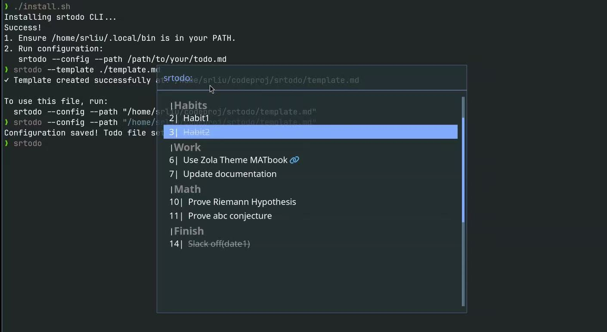

# srtodo

A minimalist, Rofi-based Todo List manager for Linux (AwesomeWM, i3, etc.).
It reads directly from a Markdown file, supports categorization, and handles links.



## Features

- 📂 **Markdown-based**: Reads/writes directly to a `.md` file.
- ✅ **Task Management**: Toggle tasks (`[ ]` <-> `[x]`) instantly.
- 🏗 **Auto-Categorization**: Tasks under headers (e.g. `## Work`) are grouped visually.
- 🔁 **Workflow Logic**:
  - Finishing a generic task moves it to a `## Finish` section with a timestamp.
  - `## Habit` tasks stay in place for daily reuse.
- 🔗 **Link Support**: Hides ugly URLs and provides a clickable link icon (also can press `Ctrl+y` to open).
- 🎨 **Rofi Interface**: Uses your system theme.

## Table of Contents

- [Features](#features)
- [Requirements](#requirements)
- [Install/Uninstall](#installuninstall)
  - [Manual Install](#manual-install)
  - [ArchLinux](#archlinux)
    - [Using AUR-helper](#using-aur-helper)
    - [Manually](#manually)
  - [Uninstallation](#uninstallation)
- [Setup](#setup)
- [Usage](#usage)
  - [Menu](#menu)
  - [Terminal Commands](#terminal-commands)
  - [Todo Markdown file](#todo-markdown-file)
  - [Optional](#optional)
    - [Shortcut through Window Manager](#shortcut-through-window-manager)
    - [Static Website Generator](#static-website-generator)

## Requirements

- [rofi](https://github.com/davatorium/rofi)
- `awk`, `sed`, `grep`, `coreutils` (Standard on almost all Linux distros)
- A Nerd Font (for the link icon)

## Install/Uninstall

### Manual Install

You only need to download the project from github, and then run the `install.sh`.

```bash
git clone https://github.com/srliu3264/srtodo.git
cd srtodo
./install.sh
```

Before runing `install.sh`, you probably need to make the shell scripts excutable.

```bash
chmod +x install.sh srtodo 
```

### ArchLinux

This is on [AUR](https://aur.archlinux.org/packages/srtodo-git), so you can install it following instructions on [ArchWiki](https://wiki.archlinux.org/title/Arch_User_Repository#Install_the_package). We briefly list two ways for readers' convenience.

#### Using AUR-helper

You can run `sudo yay -S srtodo-git` or `sudo paru -S srtodo-git`, if you have already installed [yay](https://github.com/Jguer/yay) or [paru](https://github.com/Morganamilo/paru).

#### Manually

First go to your AUR folder

```bash
cd <path-to-your-aur-folder>
```

Then run

```bash
git clone https://aur.archlinux.org/srtodo-git.git
cd srtodo-git
```

Then build the package

```bash
makepkg -si
```

You can also use your package manager to uninstall this srtodo.

### Uninstallation

You could simply run

```bash
srtodo --uninstall
```

and then it will remove `srtodo` and `.config/srtodo`

## Setup

1. Generate a Template (optional) to your specified path and file name:

```bash
srtodo --template </home/usr/todo.md>
```

2. Link your todo markdown file:

```bash
srtodo --config --path </home/usr/todo.md>
```

3. Run it to open the todo list menu:

```bash
srtodo
```

## Usage

### Menu

| Key | Action |
| -------------- | --------------- |
| `<Enter>` | Toggle task (Completed tasks move to 'Finish' section with timestamp unless they are Habits) |
| `<Ctrl> + y` | Open link in browser |
|`<Esc>`|Close Menu|

### Terminal Commands

| Commands | Action |
| -------------- | --------------- |
| `srtodo` | Open todo menu |
| `srtodo --config --path <path-to-your_todo.md>` | link your todo markdown file |
|`srtodo --template <path/your_todo.md>` | generate a `your_todo.md` template at your path |
| `srtodo --help` | see the help menu |


You can use your favorite editor to edit your `todo.md`, write new tasks or manually changes orders, etc.

### Todo Markdown file

The markdown file you used for srtodo should have the following:

```markdown
## Habits
- [ ] habit1
- [ ] habit2

## Category1
- [ ] task1
- [ ] task2
- [ ] [task3](link3)

## Category2
- [ ] task1
- [ ] task2

## Finish
- [x] finish1
```

You could remove `##Habits` category if you do not want it, but you have to have the category `## Finish`.

### Optional

#### Shortcut through Window Manager

You can add keybinds/shortcuts in your current window manager, to quickly open the menu. For example, if you also use AwesomeWM, you can simply add the following to your `rc.lua` configuration file, to use `<Super> + T` to open the todo menu:

```lua
awful.key({ "Mod4" }, "t", function ()
    awful.spawn("srtodo", false)
end, {description = "open todo", group = "launcher"})
```

#### Static Website Generator

For example, if you also use Zola, You can link a todo markdown file in your zola content folder, so you can both visit the menu through srtodo, and visualize the markdown file on your static website. Front matter required for markdown files in a zola project will be igonored in srtodo, and hence they are perfectly compatible.
